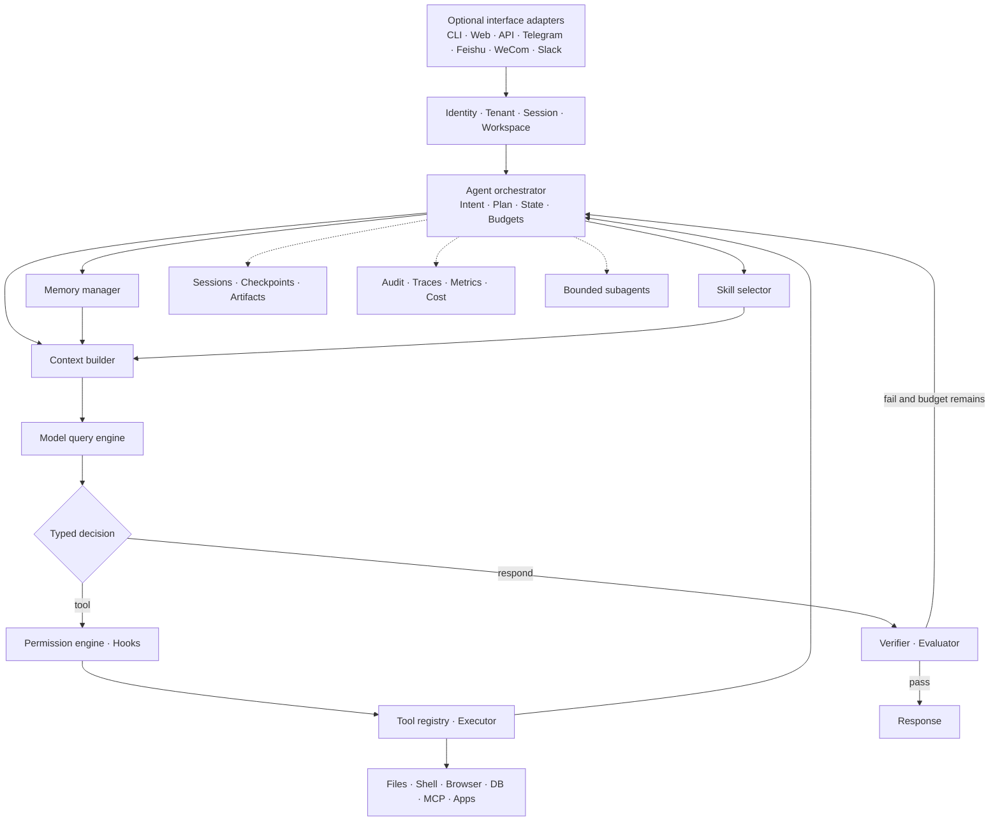
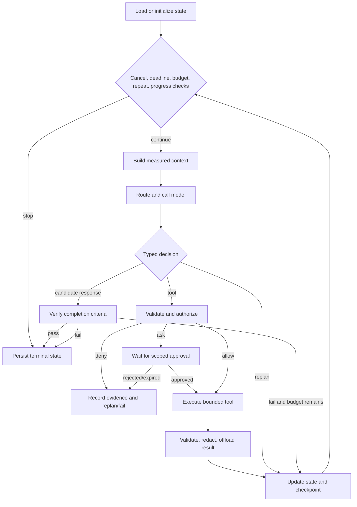

# AI Agent Engineering

AI Agent Engineering 是一套面向 Agent 系统的工程方法与实践规范，覆盖从设计、构建、重构、调试、扩展、测试、审计，到文档化与生产交付的完整生命周期。

本 Skill 遵循一条基本原则：模型只在类型化契约的范围内做出决策，而授权、预算、执行、持久化与验证等关键控制，均由确定性的程序代码完成。据此交付的 Agent 不是单一的脚本或提示词方案，而是可运行、可测试、可审计的增量系统。

本 Skill 适用于创建或升级工作区编码 Agent、持久工具调用 Agent、研究与 RAG Agent、电脑控制 Agent 及多 Agent 系统；也适用于将现有聊天机器人或单次 LLM 调用升级为安全、持久、可测试的完整 Agent 系统。

## 目录

- [它解决什么问题](#它解决什么问题)
- [核心能力](#核心能力)
- [设计理念](#设计理念)
- [工作模式](#工作模式)
- [阶段化构建 P0–P10](#阶段化构建-p0p10)
- [可选集成规则](#可选集成规则)
- [适用与不适用场景](#适用与不适用场景)
- [快速开始](#快速开始)
- [目录结构](#目录结构)
- [环境要求](#环境要求)
- [安装](#安装)
- [使用方法](#使用方法)
- [配置与契约](#配置与契约)
- [模板](#模板)
- [示例](#示例)
- [参考资料导航](#参考资料导航)
- [安全与人类控制](#安全与人类控制)
- [验证与交付物](#验证与交付物)
- [与其他 Skill 组合](#与其他-skill-组合)
- [常见问题](#常见问题)
- [开发与测试](#开发与测试)
- [贡献](#贡献)
- [许可证](#许可证)

## 它解决什么问题

很多代码 Agent 能写出“一段能跑的代码”，却不一定会主动完成以下工作：

- 先理解现有仓库、工程约束和未提交改动，再开始编辑；
- 把业务目标翻译成类型化契约、能力矩阵和带证据的验收标准；
- 让安全、权限、预算和取消机制成为**确定性代码**，而不是模型提示词的“自觉”；
- 区分“写了计划”和“真的执行并通过了验证”；
- 在缺少工具、权限或证据时诚实报告 `blocked`，而不是假装完成；
- 交付可恢复的会话、检查点、记忆、可观测性和生产就绪证据；
- 把 Channel、Model Provider 和 MCP 当作**可选、可配置、可替换**的集成，而不是硬编码死。

`ai-agent-engineering` 把上述动作组织成一条可复用的 Agent 工程流水线。它不是某个框架的代码生成器，也不会替你的项目决定技术栈；它负责让 Agent 按生产级工程方法发现、设计、实现、验证和交付一个 Agent 系统。

## 核心能力

| 能力域 | 可以完成的工作 |
| --- | --- |
| 设计（DESIGN） | 定义产品范围、架构、契约、威胁模型、数据模型、阶段计划与验收标准 |
| 工厂（FACTORY） | 把企业需求转换为 Agent Blueprint、确定性 Build Recipe、候选项目、证据映射和人工发布清单 |
| 构建（BUILD） | 从零搭建可运行的 Agent 增量，先安全后功能，先闭环后扩展 |
| 重构（REFACTOR） | 把单体 `agent.py`/`agent.ts` 模块化，保持行为不变并通过前后契约测试 |
| 审计（AUDIT） | 只读检查能力、架构、安全、评测与生产就绪缺口，输出带文件链接的证据 |
| 调试（DEBUG） | 复现并定位循环、工具、上下文、记忆、权限、持久化、路由或集成故障 |
| 扩展（EXTEND） | 一次增加一个有边界的工具、Skill、Hook、MCP、模型、Channel、记忆行为或子代理 |
| 测试（TEST） | 建立确定性测试、场景、评测和回归门禁 |
| 文档化（DOCUMENT） | 让架构、运维、部署和用户文档与当前代码保持一致 |
| 运行时机（RUNTIME） | 有界 Agent 循环、计划/重规划、取消、超时、预算、失败与无进展检测 |
| 工具系统（TOOLS） | 类型化工具注册表、命令/路径/网络安全、超时与输出上限 |
| 上下文管理（CONTEXT） | Token 预算、产物卸载、压缩、注入边界 |
| 记忆系统（MEMORY） | 生命周期、同意、检索、冲突、隔离与删除 |
| 会话与检查点 | 持久化、恢复、回退、幂等与迁移 |
| 权限与审批 | ALLOW/DENY/ASK、绑定参数的审批、凭据保护 |
| 生命周期 Hook | 事件总线、确定性策略注入、失败行为 |
| 子代理 | 有界委派、预算、DAG、结构化合并 |
| MCP 集成 | 惰性发现、适配器、信任与降级 |
| 模型路由 | 按能力/隐私/预算路由、回退、故障切换 |
| 多用户隔离 | 租户/用户/工作区/缓存/凭据隔离 |
| 可观测性 | 日志、追踪、指标、审计、成本、SLO |
| 测试与评测 | 测试金字塔、评测用例、判官、回归门禁 |
| 生产化 | 发布清单、金丝雀、事故、回滚 |
| 安全模型 | 威胁模型、滥用用例、拒绝策略 |

## 设计理念

### 模型提议，确定性代码决策

这是本 Skill 最核心的一条原则：**模型可以提出计划、生成决策、调用工具，但所有授权、预算、执行、持久化和验证必须由确定性代码完成**。模型输出、检索内容、记忆、Skill、Hook、MCP 元数据/结果、子代理结果都是**不可信输入**，它们永远不能扩展工具、权限、凭据、工作区、预算或租户范围。

所有副作用必须经过同一条确定性权限路径。硬拒绝（hard deny）优先于一切；需要人工审批的动作绑定主体、运行、工具/版本、规范化参数、风险与过期时间，参数一旦变化必须重新审批。

### 分层架构

运行时由可替换模块组成，模块之间通过显式契约连接。推荐分层如下（详见 `assets/architecture-diagram.mmd`）：



必须遵守的架构不变量：

- 领域契约**不依赖**任何 Provider SDK、CLI 框架、数据库或 MCP 库；适配器向内依赖契约；
- 检查点、产物、审计、遥测、评测、路由和子代理作为**旁路服务（sidecar）**；
- 合法状态转换必须持久化，检查点带版本，配置带指纹；
- 身份/租户/会话/工作区范围通过工具、任务、Hook、子代理、MCP、存储和遥测**不可变传播**；
- 端到端支持取消、截止时间、幂等、结构化错误、配置来源记录和密钥脱敏；
- 控制面（配置、策略、工具/Skill 目录、模型档案、路由、功能开关、评测定义）与数据面（消息、工具输入输出、产物、记忆、会话、遥测）分离，分别授权和保留。

### 不可妥协的控制循环

参考 `assets/agent-loop.mmd`，所有 Agent 运行时必须实现如下闭环：



要点：

1. 每次迭代前检查取消、截止时间、步数/重规划、Token/成本、失败、重复动作与进展；
2. 构建**已测量、有范围**的上下文包；
3. 调用模型并校验**类型化决策**；
4. 每个工具都要规范化输入、按实际参数做风险分类、走权限/审批、以沙箱/超时/输出上限/取消执行，校验/脱敏结果，卸载大产物，记录回执并检查点；
5. 只根据新证据重规划；
6. 对照显式完成标准验证候选结果；
7. 只有验证通过才算完成；否则在预算内重规划，或返回失败/部分/已取消及未满足的标准。

系统必须检测“重复工具+参数指纹”和“无进展状态”。非幂等副作用**绝不**在缺少幂等键与对账的情况下重试。

## 工作模式

根据请求推断最小适用的模式，只读请求不得修改代码或外部系统：

| 模式 | 主要产出 | 是否修改 | 必需证据 |
|---|---|---:|---|
| DESIGN | 架构、契约、ADR、能力计划 | 否 | 评审过的设计门禁 |
| FACTORY | Blueprint、Build Recipe、候选 Agent、证据与发布清单 | 是 | 候选门禁 + 人工发布审批 |
| BUILD | 可运行的 Agent 增量 | 是 | 测试 + 场景 trace |
| REFACTOR | 行为保持的模块化运行时 | 是 | 前后契约测试 |
| AUDIT | 缺口、风险与生产就绪报告 | 否 | 带文件链接的发现 |
| DEBUG | 复现原因与（获授权时的）修复 | 可能 | 先失败后通过的证据 |
| EXTEND | 增加一个有界能力 | 是 | 聚焦回归测试 |
| TEST | 评测与验证工具链 | 是 | 可执行用例与报告 |
| DOCUMENT | 与当前代码一致的架构/运维文档 | 是 | 文档对照代码核验 |

## 阶段化构建 P0–P10

不要同时启动所有模块。先交付**最小的安全闭环**，通过该阶段门禁后再扩展：

| 阶段 | 范围 | 出口门禁 |
|---|---|---|
| P0 | 章程、契约、威胁模型、权限、预算、中止 | 不安全动作无法绕过确定性策略 |
| P1 | 最小模型调用与有界 Agent 循环 | 无工具、单工具、失败、取消、最大步数用例通过 |
| P2 | 类型化工具注册表与执行器 | schema、超时、输出上限、错误封装、幂等有记录 |
| P3 | 会话、持久化、检查点、回退 | 重启与恢复测试通过 |
| P4 | 上下文构建、产物卸载、压缩 | 目标与约束在压缩后保留 |
| P5 | 有范围的记忆生命周期与检索 | 同意、冲突、隔离、删除行为通过 |
| P6 | 惰性 Skill 与生命周期 Hook | 选择与 Hook 失败策略确定 |
| P7 | 有界子代理与可选惰性 MCP/Channel | 隔离/结果契约通过；未选择的适配器标记不适用 |
| P8 | 验证器、评测器、评审路径 | 完成声明必须有证据 |
| P9 | 能力感知的模型路由器 | 回退、隐私、预算、故障用例通过 |
| P10 | 遥测、部署、SLO、runbook、回滚 | 生产就绪门禁通过 |

每个阶段的计划都要写明目标、影响文件、契约、迁移、风险、测试、完成标准与回滚。

## 可选集成规则

Channel 适配器、线上 Model Provider 和 MCP 服务器是**独立、用户可选**的集成：

- 不要求用户必须选择任何 Channel 或 MCP Server，两者默认 `none`；
- 脚手架、核心运行时、确定性测试和离线评测**不要求**线上 Model Provider，开发/测试默认 `mock`；
- 通过配置接受 Telegram、飞书/Lark、企业微信、微信公众号、Slack、Discord、Microsoft Teams、邮件、webhook、CLI、Web 或 API 适配器，绝不把 Telegram 硬编码为唯一 Channel；
- 未选中的可选集成，其测试标记为 `skipped` 或 `not_applicable`，不能阻塞核心工作流，也不能要求用户先配置；
- 只有明确要求的“线上模型验收标准”或 `production` profile 才需要真实 Provider；Channel 与 MCP 除非章程明确要求，否则始终可选；
- 配置中只允许 `secret://`、`env://`、`vault://` 形式的凭据引用，绝不把原始凭据写入项目文件。

用户未做选择时，自动生成有效的核心版 `config/integrations.config.json` 并继续执行，报告中分别列出 selected / skipped / blocked 集成。

## 适用与不适用场景

### 适合

- 从零构建编码 Agent、研究 Agent、RAG Agent、电脑控制 Agent、办公 Agent 或多 Agent 工作流；
- 把现有聊天机器人或单次 LLM 调用改造成安全、持久、可测试、可恢复的 Agent；
- 为 Agent 增加工具调用、有界循环、规划、上下文、记忆、会话/检查点、Skill、Hook、权限与审批、Channel、子代理、MCP、模型路由、验证/评测、可观测性、多用户隔离、部署与恢复；
- 对已有 Agent 运行时做只读审计（架构、安全、能力、评测、生产就绪）；
- 调试 Agent 的循环/工具/上下文/记忆/权限/持久化/路由/集成故障；
- 把 Agent 项目按 P0–P10 阶段推进到生产，并产出证据。

### 不适合

- 只需要一个与技术概念相关的简短回答或一段无仓库上下文的示例代码；
- 只做设计建议、不涉及 Agent 系统实现或改造的咨询；
- 要求不设预算、不设边界、无限重试的开放式自动执行；
- 期望仅靠提示词文本完成安全控制的“纯 Prompt Agent”；
- 没有明确工作目录、授权边界或验收目标的执行；
- 未经授权自动 commit、push、部署或修改生产数据。

## 快速开始

前提：Python 3.10+（推荐 3.11），脚本仅依赖标准库。

```bash
# 1. 从企业 Blueprint 确定性规划候选（不修改目标目录）
python3 scripts/create_agent_from_blueprint.py \
  --blueprint examples/enterprise-agent-blueprint.json \
  --target ./service-agent \
  --plan ./build-recipe.json

# 2. 审阅 Recipe 并解决 blockers 后，生成候选项目（不会发布生产）
python3 scripts/create_agent_from_blueprint.py \
  --blueprint examples/enterprise-agent-blueprint.json \
  --target ./service-agent \
  --apply \
  --report ./creation-report.json

# 也可以直接创建 Python/TypeScript 可执行参考脚手架，或语言中立 generic 脚手架
python3 scripts/scaffold_agent_project.py --language python --name "My Agent" --target ./my-agent
python3 scripts/scaffold_agent_project.py --language typescript --name "My Agent" --target ./my-agent
python3 scripts/scaffold_agent_project.py --language generic --name "My Agent" --target ./my-agent

# 3. 生成核心版可选集成配置（Channel=MCP=none，模型=mock）
python3 scripts/configure_integrations.py --output my-agent/config/integrations.config.json

# 4. 校验集成配置并按 profile 判断哪些测试该跑/该跳过
python3 scripts/validate_integration_config.py --config my-agent/config/integrations.config.json --profile development --json

# 5. 校验项目架构与安全基线
python3 scripts/validate_agent_architecture.py --project my-agent --json
python3 scripts/audit_agent_safety.py --project my-agent --json

# 6. 运行验收测试并产出机器可读证据报告
python3 scripts/run_agent_acceptance_tests.py --project my-agent \
  --config examples/acceptance-commands-python.json \
  --report my-agent/report.json

# 7. 校验本 Skill 包自身的结构（发布前）
python3 scripts/validate_skill_structure.py --skill . --json
```

Factory 是构建期控制面：`--plan` 不写目标目录，`--apply` 拒绝 blockers 和非空目标，只生成候选与待验证证据。生产发布、敏感数据访问和高风险权限始终保留人工审批。

现有项目始终保留原语言和框架；Python/TypeScript 模板只作为架构参考，不应成为迁移语言的理由。`generic` 模式只生成语言中立的配置、Schema、模块计划和契约测试计划，不生成 Python/TypeScript 源码。

然后复制并填写以下模板：`templates/agent-charter.md`（Agent 章程）、`templates/capability-matrix.md`（能力矩阵）、`templates/threat-model.md`（威胁模型）、`templates/agent-config.yaml`（运行时配置）、`templates/permission-policy.yaml`（权限策略）、`templates/acceptance-test-plan.md`（验收测试计划）。脚手架刻意保持最小化：存储、迁移、遥测、Skill、MCP 和业务工具都通过接口扩展，而不是削弱边界。

## 目录结构

```text
ai-agent-engineering/
├── SKILL.md                     # 技能入口：模式、工作流、阶段门禁、验证最低要求
├── README.md                    # 本文件
├── agents/
│   └── openai.yaml              # 可选 Host UI 元数据；缺失不影响核心 Skill
├── assets/
│   ├── architecture-diagram.mmd # 分层架构图
│   ├── agent-loop.mmd           # 不可妥协的控制循环图
│   ├── permission-flow.mmd      # 权限流图
│   ├── subagent-flow.mmd        # 子代理流程图
│   ├── agent-factory-flow.mmd   # Blueprint 到候选 Agent 的受控工厂流程
│   ├── capability-catalog.json  # 能力目录（23 项能力、状态、优先级）
│   └── phase-gates.yaml         # P0–P10 阶段与必需证据
├── references/                  # 20+ 份模块参考（按需读取，见参考资料导航）
├── schemas/                     # 9 份语言中立契约 schema（含 Agent Blueprint）
├── scripts/                     # 10 个确定性脚本（仅标准库）
├── templates/
│   ├── agent-blueprint.json     # 开发安全默认值的 Blueprint 模板
│   ├── agent-charter.md         # Agent 章程模板
│   ├── capability-matrix.md     # 能力矩阵模板
│   ├── threat-model.md          # 威胁模型模板
│   ├── agent-config.yaml        # 运行时配置模板
│   ├── permission-policy.yaml   # 权限策略模板
│   ├── acceptance-test-plan.md  # 验收测试计划模板
│   ├── integrations.config.json # 可选集成配置模板
│   ├── agent-instructions.md    # 最小安全指令模板
│   ├── tool-manifest.json       # 默认空工具目录
│   ├── tool-template.py/.ts     # 工具模板
│   ├── hook-template.py/.ts     # Hook 模板
│   ├── subagent-template.py/.ts # 子代理模板
│   ├── skill-template.md        # Skill 模板
│   ├── generic-agent/           # 语言中立模块与契约测试计划
│   ├── python-agent/            # Python 可执行参考脚手架
│   └── typescript-agent/        # TypeScript 可执行参考脚手架
├── examples/                    # Agent、企业 Blueprint、配置、trace 与评测示例
├── evals/
│   └── evals.json               # 本 Skill 自身的 10 个评测用例
└── tests/
    └── test_scripts.py          # 结构、脚本、安全负例与脚手架集成测试
```

## 环境要求

- 能读取 `SKILL.md` 的 Agent/IDE（Codex、OpenClaw、Hermes、TRAE 等）；
- Python 3.10 或更高版本（脚本仅使用标准库；脚手架代码使用 `X | None` 类型语法，Python 3.9 无法运行）；
- 可选：Node.js/TypeScript 工具链（使用 TypeScript 脚手架时）；
- 可选：Git（用于仓库状态与变更检查）；
- Agent 对目标仓库具有与任务匹配的文件和终端权限。

## 安装

请安装完整的 `ai-agent-engineering/` 目录，而不是只复制 `SKILL.md`——本 Skill 按需使用 `scripts/`、`templates/`、`references/`、`schemas/`、`assets/`、`examples/` 与 `evals/` 中的资源。

以下安装示例假设本 Skill 独立发布在 GitHub 仓库 [DannyLinjx/ai-agent-engineering](https://github.com/DannyLinjx/ai-agent-engineering) 中，仓库根目录即 Skill 根目录（直接包含 `SKILL.md`）。

### Codex

Codex 默认从 `$CODEX_HOME/skills` 发现 Skill；未设置 `CODEX_HOME` 时，默认目录为 `~/.codex/skills`。

推荐通过 Codex 内置的 `$skill-installer` 安装本仓库。在 Codex 对话中输入：

```text
Use $skill-installer to install https://github.com/DannyLinjx/ai-agent-engineering
```

也可以手动安装完整目录：

```bash
git clone https://github.com/DannyLinjx/ai-agent-engineering.git
CODEX_SKILLS_TARGET="${CODEX_HOME:-$HOME/.codex}/skills"
mkdir -p "$CODEX_SKILLS_TARGET"
cp -R ai-agent-engineering "$CODEX_SKILLS_TARGET/"
```

安装后在下一轮对话或新任务中调用；若 Skill 列表没有刷新，重启 Codex。

调用示例：

```text
Use $ai-agent-engineering to build a secure coding agent in this repository, with optional channels, models, and MCP.
```

### OpenClaw

OpenClaw 支持从本地 Skill 目录安装。默认安装到当前 workspace 的 `skills/`，`--global` 安装到共享的 `~/.openclaw/skills`：

```bash
git clone https://github.com/DannyLinjx/ai-agent-engineering.git
cd ai-agent-engineering
openclaw skills install . --as ai-agent-engineering
openclaw skills install . --as ai-agent-engineering --global
```

如果 Skill 已安装在 Codex 目录中，也可以使用 OpenClaw 官方迁移命令：

```bash
openclaw migrate plan codex
openclaw migrate codex
```

若安装成功但不可调用，请检查 OpenClaw 的 Agent allowlist（`agents.defaults.skills` 或该 Agent 的技能列表）。

### Hermes Agent

Hermes 将用户 Skill 放在 `~/.hermes/skills/`：

```bash
git clone https://github.com/DannyLinjx/ai-agent-engineering.git
mkdir -p "$HOME/.hermes/skills"
cp -R ai-agent-engineering "$HOME/.hermes/skills/"
hermes skills list
```

启动新会话并调用：

```bash
hermes chat -q "/ai-agent-engineering design and scaffold a research agent with bounded tool permissions"
```

本包包含大量脚本、schema 和模板，除非发布端已验证所有辅助文件都能被递归获取，否则不要只安装一个远程 `SKILL.md`。

### TRAE

按项目安装完整目录：

```bash
git clone https://github.com/DannyLinjx/ai-agent-engineering.git
mkdir -p YOUR_PROJECT/.trae/skills
cp -R ai-agent-engineering YOUR_PROJECT/.trae/skills/
```

最终结构应为：

```text
YOUR_PROJECT/
└── .trae/
    └── skills/
        └── ai-agent-engineering/
            ├── SKILL.md
            ├── scripts/
            ├── templates/
            └── ...
```

也可以在 TRAE 的“设置 → 技能与命令 → 创建/导入”中上传完整 Skill ZIP。TRAE 还支持开放的 `.agents/skills/` 目录：

```text
YOUR_PROJECT/.agents/skills/ai-agent-engineering/SKILL.md
```

使用 `.agents/skills/` 时，需要在 TRAE 设置中启用对应目录。不同地区、插件版和独立 IDE 的路径可能不同，请以当前版本设置页为准。

## 使用方法

### 从 Blueprint 创建企业 Agent 候选

先从 `templates/agent-blueprint.json` 创建 Blueprint，或参考 `examples/enterprise-agent-blueprint.json`。然后先规划、再应用：

```bash
python3 scripts/create_agent_from_blueprint.py \
  --blueprint <blueprint.json> --target <project> --plan <build-recipe.json>

python3 scripts/create_agent_from_blueprint.py \
  --blueprint <blueprint.json> --target <project> --apply --report <creation-report.json>
```

详细决策、状态、产物与停止条件见 `references/agent-factory.md`。生成结果是待验证的 Agent 候选，不等于已部署或生产就绪。

### 从零新建 Agent

```bash
python3 scripts/scaffold_agent_project.py --language python --name "My Agent" --target ./my-agent
```

脚手架包含最小化但完整的运行时骨架（`src/agent_runtime/` 下的 runtime、planner、tools、permissions、models、memory、sessions、context、skills、hooks、subagents、mcp、telemetry、verification、storage、channels、contracts、config），以及 `config/integrations.config.json` 和架构测试。

建议的推进顺序：

1. 填写 `templates/agent-charter.md`，明确目标、范围、自治级别、数据与租户、预算、完成与回滚、负责人；
2. 用 `templates/capability-matrix.md` 建立 21 项能力矩阵（当前状态 / 目标 / 优先级 / 验证方法 / 证据位置）；
3. 用 `templates/threat-model.md` 建立威胁模型；
4. 按 P0 → P1 → … → P10 实施最小垂直切片：每个切片先加契约测试，再实现最小行为，再静态检查、diff 审查、更新矩阵、检查点，最后通过公共接口集成；
5. 每个阶段运行验收测试并保留证据。

### 配置可选集成

```bash
# 仅生成核心版配置（Channel/MCP=none，模型=mock）
python3 scripts/configure_integrations.py --output <project>/config/integrations.config.json

# 选择飞书 + 企业微信 Channel、OpenAI 模型、GitHub MCP（stdio）
python3 scripts/configure_integrations.py \
  --channel feishu --channel wecom \
  --model-provider openai \
  --mcp-server github=stdio \
  --output <project>/config/integrations.config.json

# 校验配置并按 profile 分类哪些验收套件应运行或跳过
python3 scripts/validate_integration_config.py \
  --config <project>/config/integrations.config.json \
  --profile development --json
```

生成的配置只保存 `secret://`、`env://`、`vault://` 凭据引用，绝不写入原始密钥。`mock` Provider 提供确定性 fixture，核心测试不依赖线上模型。

### 审计与验证命令

从 Skill 目录运行，或使用绝对脚本路径：

```bash
# 生成现有项目模块清单（可带文件 hash）
python3 scripts/generate_module_manifest.py --project <project> --output <manifest.json> --include-hashes

# 评估项目是否具备耐久 Agent 的模块化基础（证据发现，不是形式化证明）
python3 scripts/validate_agent_architecture.py --project <project> --json

# 保守的静态安全审计（需要人工复核）
python3 scripts/audit_agent_safety.py --project <project> --json

# 运行有界验收命令并输出机器可读证据报告
python3 scripts/run_agent_acceptance_tests.py --project <project> --config <commands.json> --report <report.json>

# 校验本 Skill 包结构与内部链接
python3 scripts/validate_skill_structure.py --skill . --json
```

### 脚本一览

| 脚本 | 用途 |
| --- | --- |
| `create_agent_from_blueprint.py` | 从治理后的 Blueprint 生成确定性 Recipe 与候选项目；拒绝凭据、重大未知、未审批外部写入和非空目标 |
| `scaffold_agent_project.py` | 用 Python、TypeScript 或语言中立 generic 脚手架创建新 Agent 项目（支持 `--dry-run`） |
| `configure_integrations.py` | 生成可选 Channel / Model Provider / MCP 配置，不收集密钥 |
| `validate_integration_config.py` | 校验集成配置，按 profile 分类哪些测试应运行或跳过 |
| `generate_module_manifest.py` | 生成现有项目的确定性模块清单（可带 hash） |
| `validate_agent_architecture.py` | 评估模块化基础与架构边界（证据发现，需人工确认） |
| `audit_agent_safety.py` | 保守静态审计常见 Agent 安全控制缺口（需人工 triage） |
| `run_agent_acceptance_tests.py` | 运行有界验收命令并生成证据报告（argv 必须是数组，绝不使用 shell 字符串；`{python}` 会被替换为当前解释器） |
| `validate_skill_structure.py` | 校验本 Skill 包结构与内部链接 |

## 配置与契约

所有配置与状态都有语言中立的 JSON Schema（见 `schemas/`），包括：

| 文件 | 内容 |
| --- | --- |
| `schemas/agent-blueprint.schema.json` / `templates/agent-blueprint.json` | Agent 产品、感知输入、数据治理、能力、自治、服务目标、实现和验证的受治理构建契约 |
| `templates/agent-config.yaml` | 运行时参数：最大步数、重规划、超时、失败/重复动作阈值、Token/成本预算、上下文 Token 预算、压缩触发比例、权限默认值、工具白名单、Skill 根目录、记忆开关、存储、遥测 |
| `templates/permission-policy.yaml` | 默认决策、硬拒绝路径/命令、规则表（类别 + 风险等级 + 效果）、审批超时、参数绑定、脱敏规则 |
| `templates/integrations.config.json` | Channel / Model Provider / MCP 选择、凭据引用、回退顺序、测试策略 |
| `examples/tool-manifest.json` | 工具契约：输入 schema、类别、风险等级、副作用、可逆性、幂等、超时、输出上限、必需 scope、测试 |
| `examples/agent-trace.jsonl` | 端到端 trace 事件格式：请求、权限决策、工具调用、证据、最终结果 |
| `schemas/agent-state.schema.json` | 运行状态的语言中立基线 |

配置解析优先级：默认值 → 环境 profile → 租户 → 用户 → Agent → 会话 → 运行覆盖。拒绝策略与硬安全上限不能被更低作用域削弱。每次运行与检查点都要记录有效配置指纹。绝不在日志中输出原始密钥。

## 模板

`templates/` 提供：

- Agent Blueprint（Factory 的权威输入契约）；
- Agent 章程、能力矩阵、威胁模型、验收测试计划（先于代码完成）；
- `agent-config.yaml`、`permission-policy.yaml`、`integrations.config.json`（可运行配置骨架）；
- 工具、Hook、子代理的 Python/TypeScript 模板；
- Skill 模板；
- Python 与 TypeScript 两套可执行参考脚手架（含架构测试），以及不生成语言代码的 generic 脚手架。

模板是交付物骨架，不是执行证据；没有真实命令、退出码、制品或人工签核时，不能把模板项标记为通过。

## 示例

`examples/` 包含可直接对照的完整示例：

| 示例 | 内容 |
| --- | --- |
| `enterprise-agent-blueprint.json` | 企业服务运营 Agent Blueprint：多租户、机密数据、可选集成、确定性验证与人工审批 |
| `coding-agent.md` | 编码 Agent 完整垂直切片：检查项目 → 复现失败 → 诊断 → 最小补丁 → 验证 → diff 审查 |
| `research-agent.md` | 研究 Agent：有证据的技术对比、来源溯源、claim 级证据、不确定性报告 |
| `enterprise-rag-agent.md` | 企业 RAG Agent：权威结构化规则验证、租户隔离、缓存键、`indeterminate` 失败模式 |
| `computer-control-agent.md` | 电脑控制 Agent：拒绝危险策略、人工审批、对账与更安全回退 |
| `multi-agent-workflow.md` | 多 Agent DAG：研究 → 编码 → 测试 → 评审 → 父级验证，含任务契约与合并规则 |
| `complete-agent-config.yaml` | 生产化 Agent 的完整配置示例 |
| `configured-integrations.config.json` | 配置了飞书/企业微信、OpenAI+Ollama 回退、GitHub MCP 的示例 |
| `acceptance-commands-python.json` / `-optional-integrations.json` | 验收命令配置示例（含未配置可选集成的 skip 分类） |
| `agent-trace.jsonl` | 端到端 trace 示例 |
| `capability-matrix.json` / `tool-manifest.json` | 能力矩阵与工具清单的机器可读示例 |
| `eval-cases.jsonl` | 评测用例示例 |

## 参考资料导航

只按任务需要读取对应参考，不要一次性全部加载：

| 需要 | 阅读 |
|---|---|
| 从企业需求生成 Agent Blueprint、Recipe 和候选；Agent 创建 Agent | `references/agent-factory.md` |
| 循环、规划器、预算、重试、取消、完成 | `references/agent-runtime.md` |
| 工具契约、注册表、命令/路径/网络安全 | `references/tool-system.md` |
| Skill 发现、选择、作用域、脚本 | `references/skill-system.md` |
| Token 预算、产物卸载、压缩、注入边界 | `references/context-management.md` |
| 持久记忆、同意、检索、冲突、删除 | `references/memory-system.md` |
| 会话、检查点、恢复、回退、产物 | `references/session-checkpoint.md` |
| ALLOW/DENY/ASK、审批、凭据、守卫 | `references/permission-system.md` |
| 生命周期事件与确定性策略注入 | `references/hook-system.md` |
| 委派、预算、DAG、结构化合并 | `references/subagent-system.md` |
| 惰性 MCP 发现、适配器、信任、降级 | `references/mcp-integration.md` |
| Provider 网关、能力/隐私/预算路由 | `references/model-routing.md` |
| Telegram、飞书/Lark、企业微信、Slack、Web/API 等可选集成配置 | `references/channels-and-integrations.md` |
| 租户/用户/工作区/缓存/凭据隔离 | `references/multi-user-isolation.md` |
| 日志、trace、指标、审计、成本、SLO | `references/observability.md` |
| 测试金字塔、评测用例、判官、回归门禁 | `references/testing-and-evaluation.md` |
| 上线、部署、金丝雀、事故、回滚 | `references/production-checklist.md` |
| 安全边界与滥用用例 | `references/threat-model.md` |
| Codex/OpenClaw 类行为与成熟度 | `references/framework-alignment.md` |
| 反复故障诊断 | `references/troubleshooting.md` |
| 架构分层与依赖方向 | `references/architecture.md` |
| 九个步骤与停止条件 | `references/workflow.md` |
| 需求到实现的可追溯映射 | `references/source-requirements-map.md` |

## 安全与人类控制

安全是 P0，不是可选的“上线后补丁”。模型输出、检索内容、记忆、Skill、Hook、MCP 元数据/结果和子代理结果都是**不可信输入**，不能扩展工具、权限、凭据、工作区、预算或租户范围。

所有副作用走同一条确定性权限路径：

- 硬拒绝优先；
- ASK 审批绑定主体、运行、工具/版本、规范化参数/目标、风险与过期时间；
- 参数变化必须重新审批；
- 始终保护凭据、敏感文件、工作区边界、上传/消息、破坏性数据/文件/源码操作、系统安装、支付与生产变更。

出现以下情况必须停止并升级，而不是继续尝试：

- 缺少权限或不可逆操作未获授权；
- 策略解析为 DENY/ASK 且无法取得授权；
- 回滚边界不清晰，或不可逆迁移缺少已验证备份；
- 租户隔离无法证明；
- 评测/证据数据无效；
- 需要密钥或生产凭据才能完成必需能力；
- 同一失败在没有新假设的情况下反复出现。

可选 Channel / MCP / 开发用线上 Provider 的缺失**不是**停止条件。

## 验证与交付物

### 验证最低要求

按风险选择检查，但核心 Agent 发布至少覆盖：

- 无工具、单工具、多工具、工具失败、重复/无进展、取消、超时、预算耗尽；
- 权限 allow/deny/ask/reject/过期、敏感路径、命令注入、外联、破坏性与外部可见动作；
- 输出卸载与压缩后保留目标、约束、审批与未满足标准；
- 记忆的同意、检索、冲突、隔离、纠正与删除；
- 检查点/重启/回退、重复投递、部分副作用与迁移；
- 已配置 MCP 故障/schema 投毒、已配置 Channel 规范化/发送/健康、路由/回退/隐私、子代理预算/范围/合并；
- 双租户越权尝试与缓存/搜索/产物隔离；
- Factory 的 Blueprint/Recipe 确定性、凭据拒绝、重大未知阻断、外部写入审批和非空目标保护；
- 确定性验证器的负例 + `examples/` 中的相关示例。

记录命令、退出码、耗时、环境/配置/模型/工具/Skill 版本、用例 ID、指标、阈值与产物路径。生产声明还需要机器可读的就绪门禁与 `references/production-checklist.md` 中的运维证据。

即使所有可选集成都禁用，也必须运行核心检查。只跳过适配器专属检查并说明原因；绝不把未配置的适配器报告为“已测试”。

### 交付物契约

完成后必须报告：

- 结果与可工作行为；
- 架构/能力变化与受影响文件；
- 配置、schema、迁移与兼容性；
- 权限、审批、威胁控制与残余风险；
- 实际运行的测试/评测与失败/跳过项；
- 运行/部署/监控/回滚说明；
- Channel、线上 Model Provider、MCP 的选择状态（`run` / `skipped` / `not_applicable` / `blocked`）；
- 已知限制、阻塞项与优先级排序的下一阶段。

绝不伪造测试、工具调用、文件、引用、部署或生产就绪结果。

## 与其他 Skill 组合

本 Skill 专注于“构建 Agent 系统”，可以与另外两个独立发布的配套 Skill 组合使用：[engineering-coding-job](https://github.com/DannyLinjx/engineering-coding-job) 与 [loop-engineering](https://github.com/DannyLinjx/loop-engineering)：

| Skill | 职责 |
| --- | --- |
| `ai-agent-engineering` | Agent 系统的设计、构建、安全、验证与生产化 |
| `engineering-coding-job` | 端到端工程交付流水线（需求 → 架构 → 实现 → 测试 → 审查 → 发布 → 运维） |
| `loop-engineering` | 有界监督循环：计划 → 执行 → 独立验证 → 修正/回退，预算、失败指纹与人工升级 |

组合示例：

```text
Use $loop-engineering to supervise $ai-agent-engineering while building the agent in this repository.
Objective: deliver a verified agent runtime whose core loop, permission path, and checkpoint tests pass.
Completion criteria:
- C-01: no-tool, one-tool, failure, cancel, and max-step scenarios pass;
- C-02: permission allow/deny/ask and rejection tests pass;
- C-03: checkpoint/restart/rewind tests pass;
- C-04: architecture and safety audits report no unresolved P0/P1 findings.
Limits: at most 6 iterations, 120000 tokens, USD 20, 2 hours.
Do not commit, push, deploy, or configure live providers.
```

组合时，Loop 的 verifier 应检查真实的测试结果、门禁输出与制品，而不是只检查“报告文件存在”。

## 常见问题

### 安装后找不到 Skill

1. 确认目录名为 `ai-agent-engineering`；
2. 确认目录根部直接包含 `SKILL.md`，没有多嵌套一层同名目录；
3. 确认安装到了当前平台实际扫描的 Skill 根目录；
4. 重新开始会话或重启宿主应用；
5. OpenClaw 用户检查 Agent allowlist；TRAE 用户检查 Agent/SOLO 模式与 `.agents/skills` 开关。

### 为什么不能只复制 SKILL.md

`SKILL.md` 会调用包内的脚本、模板、schema、参考与示例。只复制入口文件会让部分流程退化或直接 `blocked`。

### 为什么开发/测试默认用 mock 模型

核心运行时、确定性测试与离线评测不应依赖线上 Provider；`mock` Provider 提供确定性 fixture，让 CI 可复现。只有显式要求的“线上模型验收标准”或 `production` profile 才需要真实 Provider。

### 为什么测试在 Python 3.9 上失败

脚手架与部分脚本使用 Python 3.10+ 语法（如 `X | None`）。请使用 Python 3.10 或更高版本（推荐 3.11）。

### 它会自动 commit / push / deploy 吗

不会。本 Skill 会检查并保留用户现有修改，不自动 commit、push、部署或修改外部系统。只有用户明确要求并授权时，宿主 Agent 才应执行对应动作。

### 它会替我做安全决策吗

不会。`audit_agent_safety.py` 是保守的静态审计，其结果需要人工 triage；架构验证器是证据发现工具，不是形式化证明。安全决策最终由人与确定性策略共同负责。

### 如何更新

从 GitHub 拉取新版本后，用完整的新目录替换旧版本。替换前保留你自己修改过的配置或模板；正在运行的 Agent 运行数据（会话、检查点、state）应保存在 Skill 目录之外。

## 开发与测试

```bash
# 校验包结构与内部链接
python3 scripts/validate_skill_structure.py --skill . --json

# 运行全部测试（需要 Python 3.10+）
python3 -m unittest discover -s tests -v
```

测试覆盖：全部 JSON/JSONL 可解析、包结构与可选 Host 元数据校验、Python 脚手架生成 + 配置路径完整性 + 集成配置校验 + 架构验证 + 安全审计 + 模块清单 + 验收测试（含未配置可选集成的 skip 分类）、TypeScript 脚手架 dry-run，以及 generic 语言中立脚手架。

## 贡献

欢迎提交 Issue 与 Pull Request。贡献前请：

1. 运行 `python3 scripts/validate_skill_structure.py --skill . --json` 确认包结构合法；
2. 运行 `python3 -m unittest discover -s tests -v` 确认测试通过；
3. 为新增能力补充对应的 `references/` 文档、schema 与测试；
4. 保持“模型提议、确定性代码决策”与“安全是 P0”两条核心原则。

## 许可证

本 Skill 以 [MIT License](./LICENSE) 发布，Copyright (c) 2026 DannyJ。许可证全文见仓库根目录的 `LICENSE` 文件。
