# Controlled Agent Factory Design

## Purpose

Upgrade `ai-agent-engineering` so an authorized creator agent can turn enterprise requirements into a governed, testable Agent candidate. Keep the existing runtime architecture and P0–P10 delivery sequence intact. Add a build-time control plane rather than a second runtime.

The creator agent may analyze requirements, propose architecture, generate project files, assemble optional capabilities, and run validation. Deterministic code owns schema validation, file generation, capability mapping, safety checks, evidence collection, and release status. Production deployment, sensitive data access, and high-risk permissions always require human approval.

## Source Diagram Assessment

The source diagram presents an enterprise Agent as perception, a ReAct-style core, model reasoning and prompts, skills, tools, execution environment, memory, infrastructure, and an end-to-end business loop.

### Already covered

The current Skill already covers:

- bounded runtime, typed state, planning, controlled actions, result observation, verification, replanning, errors, cost, and logs;
- model routing, structured output, fallback, context budgets, and provider-neutral interfaces;
- Skills, tools, MCP, sandboxed execution, filesystem, shell, browser, database, network, and external adapters;
- session state, checkpoints, short- and long-term memory, scoped retrieval, structured storage, knowledge access, and artifacts;
- identity, tenancy, permissions, approvals, observability, infrastructure choices, evaluation, operations, rollback, and production gates.

These modules must not be duplicated.

### Useful refinements

- Map perception to a normalized input contract for intent, entities, text, files, images/OCR, history, and external events.
- Map reflection to evidence-triggered verification and replanning. Model self-critique is never completion evidence.
- Associate instructions and prompts with version, source, fingerprint, tests, and evaluation results. Immutable safety instructions cannot be self-modified.
- Keep technology choices capability-driven. Vector databases, queues, caches, specific databases, MCP, multiple agents, and live providers remain optional.

### Missing control plane

The primary missing capability is an Agent Factory that governs how an Agent is specified, assembled, evaluated, and promoted. This layer converts business requirements into an Agent Blueprint, detects capability gaps, chooses a recipe, generates a candidate, assembles optional modules, gathers evidence, and waits for human release approval.

## Architecture

```mermaid
flowchart LR
  A["Enterprise request and inputs"] --> B["Normalize and clarify"]
  B --> C["Agent Blueprint"]
  C --> D["Capability gap and risk analysis"]
  D --> E["Architecture recipe and module selection"]
  E --> F["Deterministic project generation"]
  F --> G["Tools, knowledge, model, and policy assembly"]
  G --> H["Contracts, tests, and evals"]
  H --> I["Safety and production-readiness gates"]
  I -->|pass| J["Agent candidate and release manifest"]
  I -->|fail| D
  J --> K{"Human approval"}
  K -->|approved| L["Deploy or hand off"]
```



The Agent Factory is the build-time control plane. Generated Agents use the existing runtime execution plane. The two layers share schemas, capability statuses, safety policy, evidence formats, and P0–P10 gates, but they do not share control loops.

## Components

| Component | Responsibility | Output |
|---|---|---|
| Intake Normalizer | Normalize enterprise outcome, business flow, inputs, data, constraints, unknowns, and assumptions | Agent creation request |
| Blueprint Builder | Define the target Agent without selecting unneeded technology | `agent-blueprint.json` |
| Gap Analyzer | Compare required capabilities with the catalog and identify required, optional, planned, blocked, or not-applicable items | Capability matrix |
| Recipe Selector | Choose the scaffold and modules that satisfy hard constraints | Build Recipe |
| Deterministic Generator | Reuse the existing scaffold and create governed configuration and documentation | Candidate project |
| Assembly Planner | Declare tools, Skills, knowledge, memory, models, channels, MCP, policies, and owners | Assembly manifest |
| Validation Pipeline | Run structural, architecture, safety, test, eval, cost, and readiness checks | Evidence Bundle |
| Release Gate | Produce a non-deploying release decision and approval requirements | Release candidate manifest |

## Agent Blueprint Contract

`schemas/agent-blueprint.schema.json` is the authoritative machine-readable creation contract. `templates/agent-blueprint.json` is a valid minimal starting point.

The Blueprint contains:

- identity: stable blueprint ID, version, Agent ID, name, and owner;
- product: objective, intended users, business workflow, deliverables, non-goals, prohibited uses, and acceptance criteria;
- perception: text, file, image/OCR, history, and external-event inputs plus normalized intent/entity requirements;
- data governance: data classes, tenancy, workspace, retention, residency, consent, and compliance constraints;
- capabilities: required and optional runtime, tools, Skills, knowledge, memory, channel, MCP, model, and subagent capabilities;
- autonomy: autonomy level, allowed actions, approval-required actions, always-denied actions, and escalation owner;
- service constraints: step, token, cost, deadline, latency, availability, quality, and recovery targets;
- implementation: `python`, `typescript`, or `generic`, target profile, deployment environment, and permitted optional integrations;
- verification: mandatory scenarios, deterministic assertions, eval thresholds, security gates, and verifier type;
- assumptions and unknowns with risk and resolution status.

The schema must use closed objects for governed sections, finite enums for lifecycle and approval states, and explicit arrays for optional capabilities. It must not embed credentials or vendor-specific infrastructure as required fields.

## Build Recipe and Status Model

The Build Recipe is derived, not authored independently. It records:

- Blueprint ID and content hash;
- selected scaffold and profile;
- P0–P10 phases that are applicable;
- selected, omitted, planned, and blocked capabilities;
- files to generate and validation commands to run;
- assumptions accepted for low-risk reversible gaps;
- human approvals required before assembly or release;
- deterministic recipe hash.

Creation status is one of:

- `planned`: plan generated without project mutation;
- `generated`: candidate files created but not fully validated;
- `candidate_passed`: applicable automated gates passed;
- `candidate_failed`: generation completed but one or more automated gates failed;
- `blocked`: a material decision, capability, authority, or required input is missing;
- `awaiting_human_approval`: automated gates passed and release still needs a human decision.

No automated status means deployed or production-approved.

## Generator Interface

Add `scripts/create_agent_from_blueprint.py` with two explicit modes:

```bash
python scripts/create_agent_from_blueprint.py --blueprint <blueprint.json> --target <project> --plan <recipe.json>
python scripts/create_agent_from_blueprint.py --blueprint <blueprint.json> --target <project> --apply --report <creation-report.json>
```

`--plan` validates the Blueprint and emits a deterministic Build Recipe without creating or modifying the target project. `--apply` validates again, refuses material blockers and non-empty targets, invokes the existing scaffold through an internal function or subprocess argument array, and writes the Blueprint, recipe, capability matrix, assembly manifest, and release checklist into the candidate project.

The generator never installs dependencies, obtains credentials, commits or pushes source control, contacts live providers, or deploys. Existing project upgrades remain governed by the normal inspect-first workflow; the initial generator only targets absent or empty directories.

## Deterministic Selection Rules

- Select the scaffold from `implementation.language`.
- Convert requested input modalities into adapter requirements. Declare unimplemented OCR, events, or external systems as planned/blocked; never fabricate them.
- Enable only capabilities required by the Blueprint. Mark omitted optional modules `not_applicable`.
- Default Channel and MCP to `none` and development/test models to `mock` unless the Blueprint makes them acceptance requirements.
- Treat high-risk tools, external writes, sensitive data, production targets, and scope expansion as human-approval requirements.
- Generate instruction provenance and fingerprint metadata. Creator-proposed prompt changes remain reviewable candidates.
- Preserve P0–P10 ordering. Do not generate broad business modules before contracts, policy, budgets, and acceptance criteria.

## Perception and Reflection Mapping

The diagram's sequence maps into the governed runtime as follows:

| Diagram concept | Governed implementation |
|---|---|
| Intent, entity, context, OCR, history, event | normalized input envelope and scoped context sources |
| Observe | typed state and evidence ingestion |
| Think | model call within a typed decision contract |
| Plan | dependency-aware AgentPlan and PlanStep contracts |
| Act | authorized bounded tool execution |
| Observe result | validated ToolResult, artifact, receipt, and checkpoint |
| Reflect | verifier result and evidence-triggered replan |
| Complete | all criteria mapped to evidence and verifier pass |

This mapping avoids unbounded free-form ReAct while retaining iterative improvement.

## Failure and Approval Behavior

- Low-risk reversible missing information becomes an explicit assumption in the recipe.
- Missing architecture, data, security, cost, authority, irreversible-action, or production decisions produce `blocked` and prevent `--apply`.
- Unknown required capabilities produce a gap report; unknown optional capabilities remain planned only when they do not invalidate acceptance.
- Invalid Blueprint fields or credentials produce validation errors without writing the target.
- A non-empty target is rejected without overwrite.
- Failed validation preserves the candidate and evidence with `candidate_failed`; it cannot produce a release approval request.
- Passed automated gates produce `awaiting_human_approval`, never automatic deployment.
- Any change to normalized high-risk arguments, scope, credentials, data class, or deployment target invalidates prior approval.

## Integration With P0–P10

```text
Blueprint
→ P0 contracts, safety, permissions, budgets, and acceptance
→ P1–P2 minimal loop and tools
→ applicable P3–P9 durability and intelligence modules
→ deterministic tests, evals, safety, and evidence
→ P10 production-readiness gate
→ human release approval
```

The capability catalog and phase gates gain Agent Factory entries without renumbering or replacing existing phases. Factory artifacts become inputs and evidence for those phases.

## File Changes

Create:

- `references/agent-factory.md`
- `schemas/agent-blueprint.schema.json`
- `templates/agent-blueprint.json`
- `assets/agent-factory-flow.mmd`
- `scripts/create_agent_from_blueprint.py`
- `examples/enterprise-agent-blueprint.json`

Modify minimally:

- `SKILL.md` to route factory requests and describe the build-time control plane;
- `README.md` to document plan/apply usage and outputs;
- `assets/capability-catalog.json` and `assets/phase-gates.yaml` to include factory evidence;
- `scripts/validate_skill_structure.py` to require the new core resources;
- `tests/test_scripts.py` for generator and failure-path coverage;
- `evals/evals.json` for a create-an-enterprise-Agent case.

Do not modify the existing runtime, planner, permission, memory, context, tool execution, model routing, or checkpoint implementations for this upgrade.

## Verification

Required deterministic tests:

1. a valid Blueprint produces a stable recipe in `--plan` mode and leaves the target absent;
2. repeated planning produces byte-identical recipe content apart from no timestamps, because recipes contain no volatile fields;
3. `--apply` produces the expected Python, TypeScript, and generic files through the existing scaffold;
4. generated projects include Blueprint, recipe, capability matrix, assembly manifest, release checklist, and configuration path targets;
5. missing material decisions return `blocked` without creating the target;
6. inline credentials and invalid enums fail before any write;
7. high-risk or production Blueprints end in `awaiting_human_approval`, never deployment;
8. non-empty targets are rejected without mutation;
9. every declared required capability maps to generated evidence, `planned`, or `blocked`;
10. existing structure and scaffold tests remain green.

## Acceptance Criteria

- The Skill can take an enterprise Agent Blueprint from requirements to a reproducible candidate project and evidence bundle.
- The factory reuses the existing runtime design, scaffold, capability matrix, validation scripts, and P0–P10 gates.
- No specific model, vector store, queue, database, channel, MCP server, framework, or multi-agent topology is mandatory.
- Perception, reasoning, action, observation, and reflection are mapped to typed and verifiable boundaries.
- Creator agents cannot self-grant permissions, edit immutable safety policy, inject credentials, claim model self-review as evidence, or deploy automatically.
- All production candidates require an explicit human release decision.
