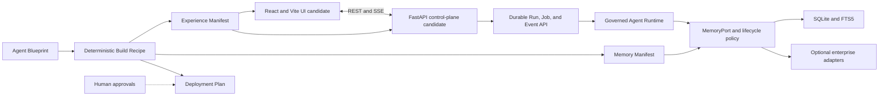

# Browser Experience and Memory Platform Design

**Date:** 2026-08-14

**Status:** Approved

## Objective

Extend `ai-agent-engineering` with two optional, governed Agent Factory capabilities:

1. generate a complete browser interaction surface for generated Agents instead of limiting users to CLI, TUI, or shell interaction;
2. generate a fast local Memory implementation for prototypes and a selectable enterprise Memory architecture, migration, installation, and deployment plan.

The upgrade remains configuration-driven, backward compatible, and limited to this Skill directory. It does not change Altair, install external services, connect production credentials, or deploy generated Agents by itself.

## Evidence basis

The browser architecture and delivery sequence are based on the completed Altair control-plane worktree, especially:

- `/Users/danny/Documents/Altair/altair-performance-agent/.worktrees/altair-control-plane/docs/ARCHITECTURE.md`;
- `web/src/features/conversations/ConversationWorkspace.tsx`;
- `web/src/features/runs/useRunEvents.ts`;
- `web/src/app/api/client.ts`;
- `src/altair_performance_agent/control/api.py`;
- `src/altair_performance_agent/control/runs/`;
- `src/altair_performance_agent/control/memory/`;
- `scripts/build_release.py`.

Altair's reusable sequence is:

1. settings, database, and additive migrations;
2. authentication, server-side sessions, CSRF, and scoped principals;
3. durable conversations, Runs, Jobs, Events, Worker leases, cancellation, and recovery;
4. immutable approvals, execution receipts, and safe evidence projection;
5. governed Memory, audit, and authorized artifacts;
6. responsive and accessible browser behavior;
7. packaged static assets, Linux deployment materials, backup, restore, and final security closure.

The design also follows current primary documentation for:

- SQLite FTS5: <https://www.sqlite.org/fts5.html>;
- pgvector: <https://github.com/pgvector/pgvector>;
- Redis vector search and persistence: <https://redis.io/docs/latest/develop/ai/search-and-query/vectors/> and <https://redis.io/docs/latest/operate/oss_and_stack/management/persistence/>;
- Neo4j vector indexes and backup: <https://neo4j.com/docs/operations-manual/current/performance/index-configuration/> and <https://neo4j.com/docs/operations-manual/current/backup-restore/>;
- Mem0 self-hosting: <https://docs.mem0.ai/open-source/setup>;
- OpenClaw Control UI: <https://docs.openclaw.ai/web/control-ui>.

## Architectural boundary

The existing Agent Factory remains a build-time control plane. Generated Agent code remains the execution plane. The Factory may normalize requirements, derive capabilities, compose templates, emit plans, and run deterministic gates. It may not install dependencies, acquire credentials, start services, migrate live data, or deploy production workloads.

The two new domains are independent optional capabilities:

- `browser-experience`: a product interaction surface, distinct from the existing `web` message Channel;
- `memory-platform`: governed durable memory with replaceable storage and retrieval adapters.

The `web` Channel continues to normalize inbound and outbound messages. Browser Experience owns sessions, Runs, progress, evidence, approvals, artifacts, Memory controls, error recovery, and administration. They may share identity and message contracts without being treated as the same capability.



## Blueprint profiles

Three new optional top-level sections are added to Agent Blueprint version 1.1. They are optional so version 1.0 Blueprints remain valid.

### Experience

```json
{
  "experience": {
    "profile": "browser_chat",
    "reference_stack": "react_fastapi",
    "auth": "server_session",
    "realtime": "sse",
    "surfaces": ["conversation", "run_inspector", "approvals", "memory"]
  }
}
```

Allowed profiles:

- `headless`: preserve current CLI/API/test behavior and emit no browser files;
- `browser_chat`: generate the complete conversation, Run, approval, artifact, and optional Memory workflow;
- `operations_console`: add Overview, all Runs, Approvals, Memory, Artifacts, Audit, Models, Capabilities, Settings, Access, and health surfaces when their capabilities are selected.

The first runnable stack is `react_fastapi`. Python candidates may receive the runnable overlay. TypeScript and generic candidates receive the same language-neutral contracts and manifests and truthfully retain the concrete backend implementation as `planned`.

### Memory

```json
{
  "memory": {
    "enabled": true,
    "profile": "local",
    "canonical_store": "sqlite",
    "keyword_index": "sqlite_fts5",
    "vector_index": "none",
    "graph_store": "none",
    "framework": "native"
  }
}
```

Allowed profiles:

- `local`: SQLite is the canonical store, FTS5 is the default retrieval index, and Markdown is import/export only;
- `hybrid`: PostgreSQL is the canonical store, PostgreSQL full-text and pgvector are the preferred retrieval components, and external acceleration remains optional;
- `enterprise`: PostgreSQL remains the preferred canonical ledger while Redis, Neo4j, Mem0, or a dedicated vector service are selected only for explicit workload and acceptance requirements.

`data_governance.retention_days` and `data_governance.consent_required` remain authoritative. The Memory section does not duplicate those policies.

### Delivery engagement

```json
{
  "delivery": {
    "engagement": "plan_only"
  }
}
```

Allowed values:

- `plan_only`: emit architecture, dependency, migration, backup, validation, and rollback plans only;
- `guided_install`: guide a user through approved steps, requesting authorization at every system, credential, network, and data boundary;
- `end_to_end`: remain engaged through design, installation, migration, validation, and handoff without gaining implicit privileges or bypassing approvals.

Missing sections normalize to `headless`, Memory disabled with a `local` profile, and `plan_only`.

## Derived capabilities and phases

Profile selection deterministically derives capability requirements:

- `browser_chat`: `browser-experience`, `session`, `checkpoint`, `security`, `permissions`, and `verification`;
- `operations_console`: the browser-chat set plus `observability`, `operations`, `multi-user-isolation`, `audit-and-artifacts`, and `realtime-events`;
- enabled Memory: `memory`, `session`, `checkpoint`, and `memory-governance`;
- enterprise Memory: enabled Memory plus `operations`, `multi-user-isolation`, `memory-migration`, and `backup-and-recovery`.

Derived requirements appear separately in Build Recipe as `derived_required`. A generated template is never upgraded from `generated` to `verified` without executable evidence.

The existing P0-P10 lifecycle is retained:

- browser identity, trust boundaries, and safe projection enter P0;
- conversation, Run, Job, Event, checkpoint, cancellation, and recovery enter P3;
- Memory remains P5;
- browser contract, security, accessibility, and E2E evidence enter P8;
- installation, migration, packaging, backup, restore, monitoring, and rollback enter P10.

## Browser Experience architecture

### Reference stack

- frontend: React, TypeScript, Vite, React Router, TanStack Query, and Zod;
- realtime: SSE with monotonically increasing cursor and durable replay;
- backend: FastAPI, Pydantic, SQLAlchemy, Alembic, and Uvicorn;
- browser verification: Playwright;
- production delivery: built Vite assets packaged into the Python artifact and served from the same origin.

Node.js is a build dependency, not a production runtime dependency for the packaged Python candidate.

### Process separation

- the API authenticates the browser, resolves an immutable Principal, enforces CSRF, writes durable commands, serves safe projections, and never runs Agent tools;
- the Worker leases Jobs, reconstructs the persisted Principal and configuration, resolves model credentials, executes the Agent Runtime, and appends durable Events;
- the browser uses REST for commands and snapshots and SSE for observation;
- cancellation, approval, and resume are durable commands and do not depend on an open browser tab.

### Core interaction flow

1. Browser submits a message plus `idempotency_key`.
2. API atomically writes Message, Run, and Job and returns `run_id`.
3. Worker leases the Job and restores Principal, model profile, target, budgets, and configuration fingerprint.
4. Agent Runtime appends safe Run Events while executing.
5. Browser consumes cursor-addressable SSE Events and reduces them idempotently.
6. A dangerous action creates an immutable approval request and changes the Run to `waiting_approval`.
7. An approval decision records a fact and creates a Resume Job.
8. Worker reconstructs and revalidates the exact action before execution.
9. Verifier writes completion evidence and terminal status.

### Browser event allowlist

The browser projection accepts only:

- `run.status`;
- `plan.updated`;
- `step.started`, `step.completed`, `step.failed`;
- `tool.started`, `tool.completed`, `tool.failed`;
- `evidence.added`;
- `artifact.created`;
- `approval.required`, `approval.resolved`;
- `memory.proposed`, `memory.stored`, `memory.rejected`;
- `verification.completed`.

It rejects hidden reasoning, raw system instructions, secrets, environment variables, absolute system paths, unrestricted command output, and unscoped Memory or artifact content.

### Surfaces

`browser_chat` includes:

- authentication or loopback-local start;
- session list and conversation workspace;
- Run Inspector with state, plan, safe tool summary, evidence, artifacts, costs, and recovery actions;
- approval interaction;
- attachment upload and authorized download;
- optional Memory inspect, correct, delete, and export;
- connection, loading, empty, error, reconnecting, cancellation, and terminal states.

`operations_console` conditionally adds:

- Overview;
- all Runs and event timelines;
- approval queue and immutable action details;
- Memory lifecycle and backend health;
- artifact governance;
- audit search and integrity;
- model, capability, Skill, MCP, and health management;
- Settings, Access, data policy, and security posture.

Every visible metric must have a real scoped API and evidence source. Empty decorative dashboards are prohibited.

### Responsive and accessible behavior

- desktop: navigation/session rail, central conversation, and docked Run Inspector;
- tablet: collapsible session rail and inspector overlay;
- mobile: bottom navigation, drawer/overlay inspector, and full core workflow;
- keyboard navigation, focus restoration, `aria-live`, reduced motion, and desktop/tablet/mobile E2E are required.

### Browser security

- loopback-only development may use a local account;
- LAN/server modes require HTTPS, trusted hosts, HttpOnly/Secure/SameSite cookies, CSRF, and explicit network configuration;
- production may use OIDC/SSO through an adapter while retaining a deterministic local test identity;
- browser tokens are not stored in `localStorage`;
- authorization filters tenant/user scope before retrieval;
- inaccessible resources return not found rather than reveal existence;
- uploads require type and size allowlists, safe download disposition, content isolation, quotas, and authorization.

## Memory Platform architecture

### Data separation

- Working Memory is ephemeral AgentState and checkpoint data.
- Conversation history is stored in the conversation service.
- Episodic Memory records task outcomes and events worth recalling.
- Semantic Memory records stable facts and preferences.
- Procedural Memory is a reviewed Skill or instruction candidate, not an automatically trusted fact.
- Knowledge Base content remains in a separate retrieval system.

### Record contract

Every durable Memory record includes:

- stable ID, version, and checksum;
- tenant, user, agent, project, session, and Run scope;
- type, normalized content, and summary;
- source, evidence references, and generation method;
- confidence, importance, and sensitivity;
- consent basis and policy version;
- created, updated, accessed, expiry, and deletion timestamps;
- conflict, correction, and supersession links;
- embedding model, dimension, and index version when applicable;
- canonical, indexing, and deletion state.

Credentials, tokens, cookies, private keys, and raw secrets are rejected.

### Write pipeline

`proposal -> scope/policy -> durable-value check -> consent -> secret rejection -> deduplication/conflict -> canonical write -> outbox -> optional indexes`

The model may propose Memory but deterministic policy owns the decision. Conflicting facts are linked and versioned rather than silently overwritten.

### Retrieval pipeline

`authenticate -> scope filter -> structured/keyword/vector/graph candidates -> rank by relevance, importance, freshness, confidence, and user/project fit -> bounded context with provenance`

Retrieved Memory is untrusted context and cannot expand authority.

### Local profile

SQLite is the only canonical source. It uses WAL, foreign keys, bounded busy timeout, versioned migrations, and tables for records, relations, lifecycle events, and index outbox. FTS5 provides the baseline keyword path. Vector retrieval is disabled by default.

Markdown is limited to:

- human-readable export;
- explicitly imported curated candidates with provenance;
- backup inspection.

It is not an automatically written concurrent canonical store.

### Enterprise component roles

- PostgreSQL: canonical records, transactions, lifecycle, audit, full-text, tenant fields, constraints, and optional row-level policy;
- pgvector: vector and hybrid retrieval where semantic search is required;
- Redis: optional session/retrieval cache, rate limit, queue, or latency layer; not the default sole durable source;
- Neo4j: optional entity, temporal, and multi-hop relationship queries only when graph acceptance cases justify it;
- Mem0: optional extraction, personalization, and retrieval adapter that remains behind the Skill's governance, scope, consent, and deletion contracts;
- dedicated vector service: selected only when pgvector cannot meet measured scale, availability, or operations requirements.

Exactly one canonical store is authoritative.

### Migration

SQLite-to-enterprise migration follows:

1. inventory schema, records, sensitivity, and volumes;
2. create and verify a consistent recoverable backup;
3. create target schema, role, SecretRefs, retention, and encryption policy;
4. migrate a representative sample while preserving ID, scope, provenance, and lifecycle;
5. copy canonical records;
6. rebuild full-text, vector, and graph indexes rather than blindly copy incompatible embeddings;
7. enable outbox or controlled dual-write;
8. shadow retrieval and compare isolation, recall, latency, and cost against the frozen baseline;
9. require cutover approval;
10. retain rollback until backup restore and deletion propagation are proven.

## Factory artifacts

Existing Factory artifacts remain. Three artifacts are added:

- `factory/experience-manifest.json`;
- `factory/memory-manifest.json`;
- `factory/deployment-plan.json`.

The Deployment Plan records dependencies, topology, ports, volumes, SecretRefs, migrations, backup, validation, approvals, cutover, and rollback. It never contains raw secret values or claims installation occurred.

## Skill package changes

### New references and assets

- `references/browser-experience.md`;
- `references/memory-deployment.md`;
- `assets/browser-control-plane.mmd`;
- `assets/memory-platform.mmd`.

### New schemas

- `schemas/experience-manifest.schema.json`;
- `schemas/memory-manifest.schema.json`;
- `schemas/browser-run-event.schema.json`;
- `schemas/deployment-plan.schema.json`.

Existing Agent Blueprint, Agent Config, and Production Readiness schemas are extended without invalidating version 1.0 Blueprints.

### New configuration and examples

- `templates/memory.config.json`;
- `examples/browser-enterprise-agent-blueprint.json`;
- `examples/local-memory-agent-blueprint.json`.

### Browser overlay

`templates/browser-react-fastapi/` is a composable overlay containing a React/Vite frontend and FastAPI control plane. It does not replace the existing Python, TypeScript, or generic scaffolds.

### Memory template decomposition

The Python Memory template is split into contracts, policy, SQLite store, retrieval, and migrations. The current `memory.py` remains a compatibility export. Generic output gains a language-neutral Memory adapter plan.

### Scripts

Extend:

- `create_agent_from_blueprint.py`;
- `scaffold_agent_project.py`;
- `validate_agent_architecture.py`;
- `validate_skill_structure.py`.

Add:

- `validate_experience_manifest.py`;
- `validate_memory_manifest.py`;
- `plan_memory_deployment.py`.

All planning commands are non-mutating except for explicitly named output files. No script installs a dependency or starts a service.

## Validation conflicts

Factory blocks or truthfully reports:

- production Operations Console with authentication disabled;
- enterprise Memory using SQLite as the production canonical store;
- enabled Memory without the Memory capability;
- vector dimension/model/index incompatibility;
- Neo4j without a graph acceptance case;
- Redis as sole canonical source without explicit persistence and recovery evidence;
- Browser code resolving model or database credentials;
- browser events containing hidden reasoning or raw environment data;
- required UI implemented only as contracts but reported complete;
- `end_to_end` interpreted as automatic administrative authority.

## Implementation sequence

1. contracts, schemas, defaults, and backward compatibility;
2. deterministic Factory planning and the three new manifests;
3. local SQLite/FTS5 Memory vertical slice;
4. FastAPI/React browser vertical slice with durable Runs and SSE;
5. approvals, artifacts, Memory UI, and audit interaction;
6. conditional Operations Console modules;
7. enterprise Memory adapter contracts and non-mutating deployment/migration planning;
8. packaging, responsive/browser acceptance, security closure, and evidence handoff.

## Verification

### Core Skill gates

- every JSON/JSONL file parses;
- structure and internal links pass;
- old Blueprint and scaffold tests pass;
- missing new sections normalize safely;
- same Blueprint produces byte-identical plans;
- headless mode emits no Web files;
- disabled Memory emits no external database dependencies;
- non-empty targets remain protected;
- inline credentials are rejected before writes;
- apply never installs, downloads, starts services, or deploys.

### Browser gates

- schema and safe event projection;
- auth, server sessions, CSRF, tenant/user scoping, and idempotency;
- durable Run/Job/Event, cancellation, cursor replay, deduplication, gap recovery, approval, and resume;
- attachment policy and artifact authorization;
- React unit/contract tests;
- Playwright desktop, tablet, and mobile flows;
- accessibility and sensitive-data leak checks;
- packaged asset and installed-wheel smoke tests.

### Memory gates

- temporary facts are not durably stored;
- durable facts require the declared consent path;
- duplicates merge and conflicts remain visible;
- sensitive content and credentials are rejected;
- retrieval is scope-safe and provenance-bearing;
- expiry, correction, deletion, export, and index rebuild work;
- embedding changes trigger reindex planning;
- backend outages enter safe degraded states;
- backup restore and migration preserve IDs, scope, provenance, and lifecycle;
- optional live adapters are skipped/not applicable unless selected and configured.

## Non-goals

- modify Altair;
- force Web UI on every Agent;
- force vector retrieval on every Memory implementation;
- install or run PostgreSQL, Redis, Neo4j, Mem0, or another vector service during Factory generation;
- connect production databases or credentials;
- deploy to a server or cloud environment;
- provide a second complete TypeScript browser backend in this upgrade;
- claim generated candidates are production ready.

## Definition of done

The upgrade is complete only when:

- existing headless behavior has no regression;
- new Blueprints deterministically produce Experience, Memory, and Deployment plans;
- the Python browser profile generates a complete runnable reference candidate;
- the local Memory profile has executable lifecycle and FTS5 templates plus tests;
- enterprise Memory services remain optional and governed;
- Factory retains non-overwrite, no-install, no-deploy, and human-release rules;
- documentation, schemas, examples, scripts, templates, and tests agree;
- every completion claim is backed by executable evidence or a precise not-applicable/blocked status.
